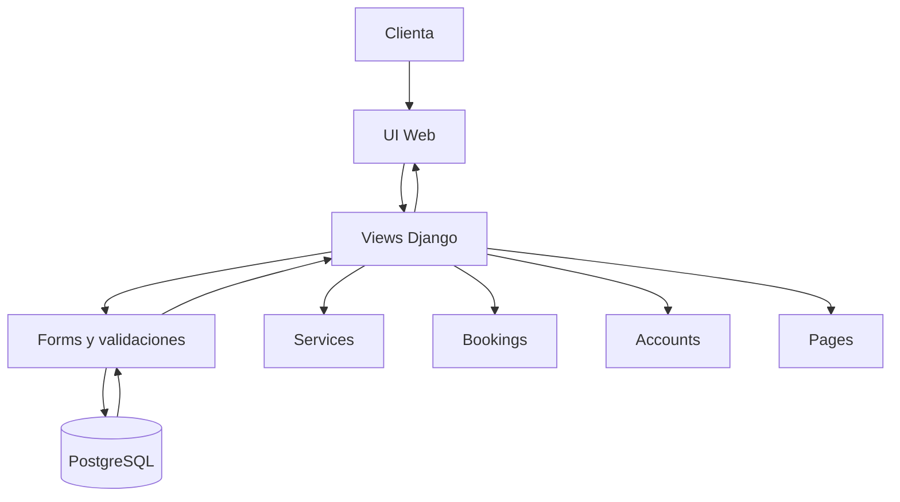

# Appointment Booking System

Plataforma de reservas para un salon de extensiones de pestañas. Centraliza disponibilidad, servicios y gestion administrativa en un flujo claro para clientas y staff, con foco en evitar dobles reservas.

## Contexto del problema
Los salones pequeños suelen gestionar agenda por whatsapp, lo que genera perdida de tiempo, errores de disponibilidad y baja trazabilidad. Este sistema busca unificar el proceso de reserva en linea y entregar una vista operativa simple al negocio.

## Publico objetivo
- Clientas que necesitan reservar y reprogramar sin llamadas.
- Administracion del salon que gestiona servicios, horarios y estados de reservas.
- Negocios de belleza con operacion de uno o pocos profesionales.

## Arquitectura explicada
Arquitectura monolitica con Django y apps separadas por dominio. El flujo principal va desde la interfaz web a vistas Django, pasa por formularios de validacion y persiste en PostgreSQL.

Componentes principales:
- Core: configuracion, ruteo y paginas base.
- Services: catalogo de servicios y manejo de horarios (availability slots).
- Bookings: reservas, validaciones y dashboard operativo.
- Accounts: autenticacion y perfiles de clientas.
- Pages: contenido editable para secciones publicas.

Flujo simplificado:
1) Cliente selecciona servicio y fecha
2) Se listan slots disponibles
3) Se confirma reserva y se persiste

## Diagrama simple

## Decisiones tecnicas
- Django: acelera el desarrollo y aporta un stack estable para formularios, auth y admin.
- PostgreSQL: soporte robusto para consultas y consistencia en reservas.
- Separacion por apps: reduce acoplamiento y facilita mantenimiento.
- Slots como entidad propia: permite controlar disponibilidad y evitar dobles reservas.
- Whitenoise y configuracion por variables de entorno: despliegue simple en entornos cloud.

## Futuras mejoras
- Multi-profesional: asignar servicios y slots por especialista.
- Pagos en linea y confirmacion automatica.
- Notificaciones por email/WhatsApp con recordatorios.
- Panel de analitica avanzada (retencion, conversion, ticket promedio).
- Lista de espera y reprogramacion automatica.
- API publica para integraciones y app movil.
